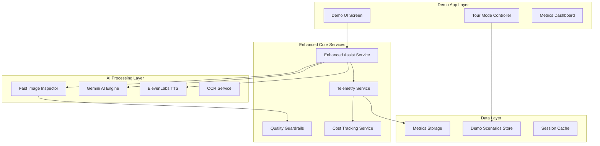

# Nadar Demo App Design Document

## Overview

The Nadar Demo App is a streamlined demonstration layer built on top of the existing Nadar AI-powered visual assistance platform. It provides a focused, single-screen experience that showcases core capabilities through guided scenarios while serving as a testbed for improved assist quality, comprehensive telemetry, and cost visibility.

The design leverages the existing server infrastructure (Express.js backend with Gemini AI integration) and mobile app foundation (React Native with Expo) while adding demo-specific features and enhanced monitoring capabilities.

## Architecture

### Integration with Existing Nadar Platform

The demo app leverages the existing Nadar infrastructure while adding focused enhancements:

**Reused Components**:

- Server API endpoints (/describe, /ocr, /qa, /tts) with enhanced routing
- React Native app foundation with Expo camera integration
- HybridProvider for TTS (Gemini + ElevenLabs fallback)
- Image processing utilities (downscale, base64 conversion)
- Settings management and network discovery

**New Components**:

- Fast image inspector for signal detection
- Enhanced telemetry with cost tracking
- Demo scenario management
- Quality guardrails and user guidance

### High-Level Architecture



### Component Interaction Flow

1. **Demo UI** captures image/audio and sends to Enhanced Assist Service
2. **Fast Image Inspector** analyzes image for text, hazards, people, lighting
3. **Quality Guardrails** evaluate image quality and provide guidance
4. **Gemini Engine** processes request with inspection signals as context
5. **TTS Service** converts response to audio with auto-play
6. **Telemetry Service** logs comprehensive metrics and cost data
7. **Follow-up Controller** manages session context for additional questions

### Sprint Implementation Priorities

Based on the P0-P2 sprint plan, the architecture supports phased implementation:

**P0 - Assist Quality & Telemetry**:

- Fast image inspector returns JSON signals for routing decisions
- Single-paragraph response generation with safety-first ordering
- Comprehensive telemetry logging with cost estimation
- /metrics endpoint for real-time monitoring

**P1 - Demo App & Follow-ups**:

- Standalone demo app reusing existing API client
- Tour mode with canned scenarios for consistent demos
- Follow-up chips using imageRef:"last" for session continuity
- Engine comparison toggle for development evaluation

**P2 - Quality & Accessibility**:

- Quality guardrails with Darija guidance messages
- Enhanced screen reader integration and focus management
- CI pipeline with accessibility testing automation

## Components and Interfaces

### 1. Demo UI Screen Component

**Purpose**: Single-screen interface providing streamlined demo experience

**Key Features**:

- Shutter and microphone controls
- Tour mode selector (office, street, menu scenarios)
- Response display with collapsible "More" section
- Follow-up question chips (up to 3)
- Accessibility-first design with screen reader support

**Interface**:

```typescript
interface DemoScreenProps {
  tourMode: boolean;
  selectedScenario?: "office" | "street" | "menu";
  onCapture: (image: ImageData, audio?: AudioData) => void;
  onTourScenario: (scenario: string) => void;
}

interface DemoResponse {
  mainParagraph: string;
  additionalDetails?: string[];
  followUpSuggestions: string[];
  hasText: boolean;
  audioUrl?: string;
}
```

### 2. Enhanced Assist Service

**Purpose**: Core processing service with improved response quality and routing

**Design Decisions**:

- **Single-paragraph responses**: Prioritizes concise, action-first answers in Darija
- **Inspection-driven routing**: Uses fast image analysis to determine response format
- **Session context management**: Maintains image context for follow-up questions

**Interface**:

```typescript
interface EnhancedAssistRequest {
  image: ImageData;
  audio?: AudioData;
  question?: string;
  sessionId?: string;
  isFollowUp: boolean;
}

interface AssistResponse {
  response: string;
  confidence: number;
  detectedSignals: ImageSignals;
  followUpSuggestions: string[];
  costEstimate: CostBreakdown;
  processingTime: number;
}
```

### 3. Fast Image Inspector

**Purpose**: Rapid image analysis to detect key signals for response routing

**Capabilities**:

- Text detection and OCR confidence scoring
- Hazard identification (safety-critical elements)
- People counting and crowd density
- Lighting quality assessment
- Scene categorization

**Interface**:

```typescript
interface ImageSignals {
  hasText: boolean;
  textConfidence: number;
  hazardLevel: "none" | "low" | "medium" | "high";
  peopleCount: number;
  lightingQuality: "poor" | "fair" | "good";
  sceneType: string;
  ocrText?: string;
}
```

### 4. Tour Mode Controller

**Purpose**: Manages offline demo scenarios with pre-recorded responses

**Design Rationale**: Ensures consistent demo experience regardless of network conditions

**Features**:

- Three canned scenarios with saved image/audio pairs
- Mocked API responses with realistic timing
- Seamless transition between online/offline modes

### 5. Telemetry and Cost Tracking Service

**Purpose**: Comprehensive monitoring and cost visibility

**Metrics Collected**:

- Request timing (P95 latency tracking)
- Engine performance comparisons
- Token usage and cost calculations
- Feature engagement analytics
- Quality signals and success rates

**Interface**:

```typescript
interface TelemetryEvent {
  timestamp: Date;
  requestId: string;
  engine: "gemini" | "live-assist";
  processingTime: number;
  tokenUsage: TokenUsage;
  costEstimate: CostBreakdown;
  imageSignals: ImageSignals;
  userEngagement: EngagementMetrics;
}

interface CostBreakdown {
  geminiTokens: number;
  geminiCost: number;
  elevenLabsChars: number;
  elevenLabsCost: number;
  totalCost: number;
}
```

## Data Models

### Demo Scenario Model

```typescript
interface DemoScenario {
  id: string;
  name: "office" | "street" | "menu";
  imageUrl: string;
  audioUrl?: string;
  mockResponse: DemoResponse;
  expectedSignals: ImageSignals;
}
```

### Session Context Model

```typescript
interface SessionContext {
  sessionId: string;
  lastImage: ImageData;
  conversationHistory: AssistResponse[];
  createdAt: Date;
  expiresAt: Date;
}
```

### Metrics Aggregation Model

```typescript
interface MetricsSnapshot {
  timeWindow: string;
  totalRequests: number;
  averageLatency: number;
  p95Latency: number;
  errorRate: number;
  totalCost: number;
  engineBreakdown: Record<string, number>;
  topFeatures: FeatureUsage[];
}
```

## Error Handling

### Image Quality Issues

- **Low confidence detection**: Provide Darija guidance ("ما واضحش… قرّب الكاميرا ولا زيد ضو")
- **Poor lighting**: Suggest better lighting before processing
- **Unclear images**: Offer automatic recapture suggestions
- **Processing failures**: Clear, actionable error messages in user's preferred language

### Network and API Failures

- **Offline mode**: Seamless fallback to cached demo scenarios
- **API timeouts**: Graceful degradation with retry mechanisms
- **Cost limits**: Soft limits with user notification before hard cutoffs
- **Rate limiting**: Queue management with user feedback

### Accessibility Failures

- **Screen reader issues**: Fallback to basic text announcements
- **TTS failures**: Text-only mode with clear indication
- **Voice control problems**: Visual feedback alternatives

## Testing Strategy

### Unit Testing

- **Component isolation**: Test each service independently
- **Mock dependencies**: Use test doubles for AI services
- **Edge case coverage**: Focus on error conditions and boundary cases
- **Accessibility testing**: Automated screen reader compatibility checks

### Integration Testing

- **End-to-end scenarios**: Test complete user journeys
- **API contract testing**: Verify service interfaces
- **Performance testing**: Latency and throughput validation
- **Cost estimation accuracy**: Validate cost calculations

### Demo Reliability Testing

- **Offline mode validation**: Ensure consistent demo experience
- **Network transition testing**: Smooth online/offline switching
- **Scenario consistency**: Verify canned responses match expectations
- **Presentation environment testing**: Various network conditions

### Accessibility Testing

- **Screen reader compatibility**: VoiceOver/TalkBack integration
- **Voice-first navigation**: Audio-only interaction flows
- **Haptic feedback**: Touch and vibration response validation
- **Focus management**: Proper focus flow for assistive technology

## Performance Considerations

### Response Time Optimization

- **Fast image inspection**: < 500ms for initial signal detection
- **Parallel processing**: Concurrent AI service calls where possible
- **Caching strategy**: Session context and repeated scenario responses
- **Progressive loading**: Stream responses as they become available

### Cost Optimization

- **Token efficiency**: Optimized prompts to minimize Gemini usage
- **TTS chunking**: Efficient audio generation for long text
- **Inspection-based routing**: Avoid expensive calls for simple queries
- **Real-time cost tracking**: Prevent unexpected usage spikes

### Mobile Performance

- **Memory management**: Efficient image and audio handling
- **Battery optimization**: Minimize background processing
- **Network efficiency**: Compress payloads and batch requests
- **Offline capability**: Reduce dependency on network calls

## Security and Privacy

### Data Handling

- **Image processing**: No persistent storage of user images
- **Session management**: Automatic cleanup of temporary data
- **Telemetry privacy**: Anonymized metrics collection
- **Demo scenarios**: Static, non-sensitive content only

### API Security

- **Rate limiting**: Prevent abuse of AI services
- **Input validation**: Sanitize all user inputs
- **Error information**: Avoid exposing internal system details
- **Cost controls**: Hard limits to prevent unexpected charges
